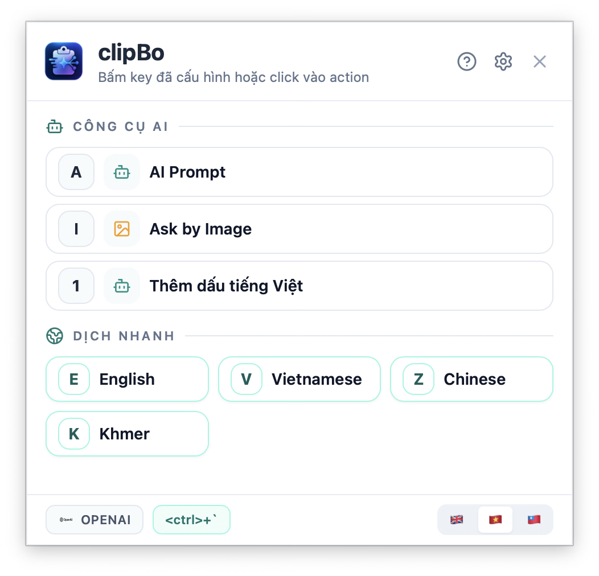

# ClipBo

<p align="center">
  <strong>Open-source AI Smart Actions for clipboard, selected text, and screenshots.</strong>
</p>

<p align="center">
  <a href="#english">English</a> ·
  <a href="#vietnamese">Tiếng Việt</a> ·
  <a href="#chinese">中文</a>
</p>

---

<a id="english"></a>
## English

**ClipBo** is a free and open-source desktop app that turns your clipboard, selected text, and screenshots into instant AI actions.

Built with **React / Vite + Tauri / Rust**.

### Screenshots
<p align="center">
  
</p>

### Features
- Global AI action popup
- Smart Action CRUD
- AI Prompt (one-shot + chat)
- Ask by Image (clipboard image + ROI capture)
- Gemini / OpenAI-compatible / Ollama
- Clipboard copy & pasteback
- macOS permissions flow
- Multilingual defaults (EN/VI/ZH)

### Release
- Latest: `v0.3.2` on GitHub Releases — macOS (Intel/Apple Silicon) + Linux (AppImage, .deb).
- Also available: `v0.2.0-beta`.

### macOS Note (Important)
- ClipBo is currently free and open-source, and **not notarized yet**.
- On macOS, you may see a security warning when opening the app for the first time.

### Platform Plan
- Linux (Ubuntu) is now supported — see build instructions below.
- Windows 11 support is planned soon.

### Development
```bash
chmod +x run.sh
./run.sh
```

Or:

```bash
. "$HOME/.cargo/env"
cd webui
npm install
npm run tauri:dev
```

Build (macOS):

```bash
cd webui
npm run tauri:build
```

Build (Linux — produces AppImage + .deb):

```bash
chmod +x build_linux.sh
./build_linux.sh
```

Or manually on Linux:

```bash
cd webui
npm install
npm run tauri:build
```

Output: `webui/src-tauri/target/release/bundle/`

### Linux Runtime Notes
- X11 window management is handled natively (no xdotool required).
- Screen region capture requires one of: `gnome-screenshot`, `flameshot`, `grim+slurp`, or `scrot`.
  - Ubuntu: `sudo apt install gnome-screenshot`
  - Wayland: `sudo apt install grim slurp`
- Multi-monitor popup positioning uses `xrandr` (included by default on most distros).
- The `xdotool` dependency has been fully eliminated — all X11 operations now use native Rust bindings.

### License
MIT License.

---

<a id="vietnamese"></a>
## Tiếng Việt

**ClipBo** là app desktop miễn phí, mã nguồn mở, giúp biến clipboard, selected text và screenshot thành AI Smart Actions dùng ngay bằng hotkey.

Xây dựng với **React / Vite + Tauri / Rust**.

### Ảnh giao diện
<p align="center">
  
</p>

### Tính năng
- Popup action toàn cục
- CRUD Smart Action
- AI Prompt (một lần + chat tiếp)
- Ask by Image (ảnh clipboard + ROI)
- Hỗ trợ Gemini / OpenAI-compatible / Ollama
- Copy / pasteback về app đích
- Luồng quyền macOS
- Action mặc định đa ngôn ngữ (EN/VI/ZH)

### Release
- Mới nhất: `v0.3.2` trên GitHub Releases — macOS (Intel/Apple Silicon) + Linux (AppImage, .deb).
- Cũng có sẵn: `v0.2.0-beta`.

### Ghi chú macOS (Quan trọng)
- ClipBo hiện là app miễn phí, mã nguồn mở và **chưa notarize**.
- Trên macOS, bạn có thể thấy cảnh báo bảo mật ở lần mở đầu tiên.

### Kế hoạch nền tảng
- Bản Linux (Ubuntu) đã được hỗ trợ — xem hướng dẫn build bên dưới.
- Bản Windows 11 cũng đang được lên kế hoạch phát hành sớm.

### Chạy dev
```bash
chmod +x run.sh
./run.sh
```

Hoặc:

```bash
. "$HOME/.cargo/env"
cd webui
npm install
npm run tauri:dev
```

Build (macOS):

```bash
cd webui
npm run tauri:build
```

Build (Linux — tạo AppImage + .deb):

```bash
chmod +x build_linux.sh
./build_linux.sh
```

Hoặc build thủ công trên Linux:

```bash
cd webui
npm install
npm run tauri:build
```

Output: `webui/src-tauri/target/release/bundle/`

### Ghi chú Linux
- Quản lý cửa sổ X11 được xử lý native (không cần xdotool).
- Chụp màn hình vùng chọn cần một trong: `gnome-screenshot`, `flameshot`, `grim+slurp`, hoặc `scrot`.
  - Ubuntu: `sudo apt install gnome-screenshot`
  - Wayland: `sudo apt install grim slurp`
- Định vị popup đa màn hình dùng `xrandr` (có sẵn trên hầu hết distro).
- Đã loại bỏ hoàn toàn phụ thuộc `xdotool` — tất cả thao tác X11 dùng Rust native binding.

### License
MIT License.

---

<a id="chinese"></a>
## 中文

**ClipBo** 是一个免费开源桌面应用，可将剪贴板、选中文本与截图快速转换为 AI Smart Actions。

基于 **React / Vite + Tauri / Rust** 构建。

### 功能
- 全局 AI 弹窗
- Smart Action 增删改查
- AI Prompt（单轮 + 连续聊天）
- Ask by Image（剪贴板图片 + 区域截图）
- 支持 Gemini / OpenAI-compatible / Ollama
- 剪贴板复制与粘贴回填
- macOS 权限流程
- 多语言默认动作（EN/VI/ZH）

### 界面截图
<p align="center">
  
</p>

### 平台计划
- Linux（Ubuntu）现已支持 — 构建说明见下方。
- Windows 11 版本也在近期计划中。

### 开发
```bash
chmod +x run.sh
./run.sh
```

或：

```bash
. "$HOME/.cargo/env"
cd webui
npm install
npm run tauri:dev
```

构建 (macOS)：

```bash
cd webui
npm run tauri:build
```

构建 (Linux — 生成 AppImage + .deb)：

```bash
chmod +x build_linux.sh
./build_linux.sh
```

或手动构建 (Linux)：

```bash
cd webui
npm install
npm run tauri:build
```

输出：`webui/src-tauri/target/release/bundle/`

### Linux 运行说明
- X11 窗口管理使用原生实现（无需 xdotool）。
- 区域截图需要以下工具之一：`gnome-screenshot`、`flameshot`、`grim+slurp` 或 `scrot`。
  - Ubuntu: `sudo apt install gnome-screenshot`
  - Wayland: `sudo apt install grim slurp`
- 多显示器弹窗定位使用 `xrandr`（大多数发行版默认包含）。
- 已完全移除 `xdotool` 依赖 — 所有 X11 操作使用 Rust 原生绑定。

### License
MIT License.
